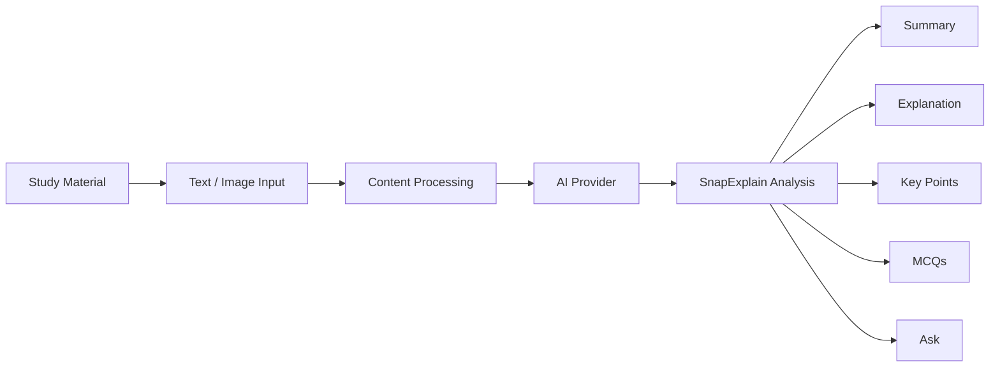

# 🌊 SnapExplain

<p align="center">
  
</p>

<h2 align="center">Understand Anything. Keep It Private.</h2>

<p align="center">
  Privacy-first AI study assistant for turning notes and screenshots into simple explanations, summaries, key points, and quizzes.
</p>

<p align="center">
  <a href="https://react.dev/"></a>
  <a href="https://vitejs.dev/"></a>
  <a href="https://www.typescriptlang.org/"></a>
  <a href="https://tesseract.projectnaptha.com/"></a>
</p>

---

## 🧠 What is SnapExplain?

SnapExplain takes study material supplied as text or screenshots and transforms it into:

- **Simple explanations** breaking down difficult concepts
- **Summaries** condensing material into digestible insights
- **Key points** extracting the most important ideas
- **Interactive MCQs** for knowledge retention
- **Contextual questions** through an interactive chat interface grounded in your content

It features a polished dark-mode interface with an immersive WebGL fluid background, glassmorphism, and responsive layout for a focused study environment.

## 🎯 Why SnapExplain?

Students often have dense notes, messy screenshots, technical terminology, and fragmented study material. 

SnapExplain focuses on turning that material into something easier to understand and revise, utilizing a local-first design. Rather than transmitting personal study notes or textbooks to external servers, the application is structured so that OCR extraction runs directly in the browser and AI generation targets local backend endpoints for maximum privacy.

## ⚙️ How It Works



Behind the scenes:
- **AI Provider Abstraction:** A flexible `ProviderFactory` manages AI endpoints (in `src/ai/`).
- **DemoProvider:** An implementation returning simulated AI responses for rapid UI testing.
- **LocalLLMProvider:** Scaffolding for local endpoints (e.g., Ollama or NPU-accelerated APIs).
- **OCR Service:** Uses `tesseract.js` for on-device image text extraction.
- **Frontend Components:** Modular React components handle stateful rendering for results, quizzes, and chat interactions.

## 💻 Snapdragon Relevance

As a privacy-focused study application, SnapExplain is highly suitable for AI PCs powered by Snapdragon processors. 

- **Local Inference:** Leveraging an NPU allows models to run efficiently on-device without compromising battery life.
- **Privacy & Autonomy:** Students handle sensitive notes without requiring an internet connection or exposing data to cloud providers.
- **Extensible Architecture:** The AI provider abstraction enables seamless swapping between simulated responses, local endpoints, or cloud APIs.

> **Note:** The application is architected to support these capabilities. Actual Snapdragon hardware validation is currently pending.

## 🚀 Getting Started

Clone the repository and start the development server:

```bash
# 1. Clone the repository
git clone https://github.com/ankush-dev-eng/SnapExplain.git
cd SnapExplain

# 2. Install dependencies
npm install

# 3. Start development server
npm run dev
```

## 🧪 Testing & Validation Status

| Component | Status | Notes |
| :--- | :--- | :--- |
| **Vite / React Build** | PASS | Successfully compiles and serves via `npm run build` |
| **UI Components** | PASS | All tabs, quizzes, and chat interactions render correctly |
| **Demo AI Provider** | PASS | Mock responses return and populate UI successfully |
| **In-Browser OCR** | PENDING | Scaffolded via `tesseract.js`; end-to-end extraction pending |
| **Local LLM Inference**| PENDING | Provider implemented; requires active local endpoint to verify |
| **Snapdragon NPU** | UNTESTED | Architecture supports it; hardware validation not yet performed |

<br/>

<p align="center">
  
</p>
