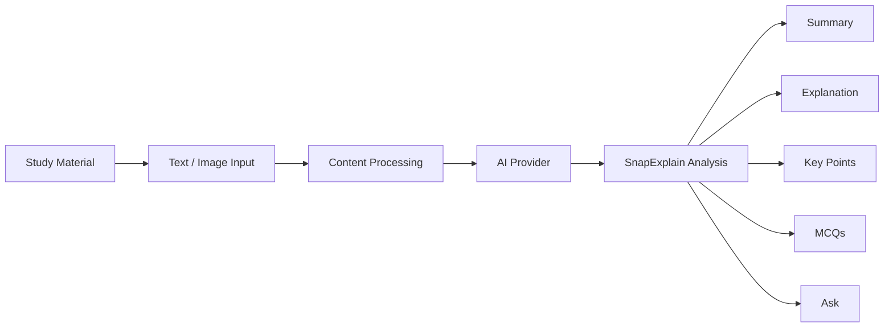

<div align="center">

# 🧠 SnapExplain

[](https://git.io/typing-svg)


**A privacy-first AI study assistant that transforms notes and screenshots into simple explanations, summaries, key points, and interactive quizzes.**

Instead of fighting through dense blocks of textbook text or messy screenshots, SnapExplain digests the material and presents it in multiple interactive, learning-optimized formats. All designed around a local-first abstraction to keep your study material private.

[](https://react.dev/)
[](https://www.typescriptlang.org/)
[](https://vitejs.dev/)
[](https://tailwindcss.com/)
[](https://tesseract.projectnaptha.com/)

  

</div>

---

### 🧠 What is this?

> Study material can be dense, fragmented, screenshot-heavy, and difficult to revise from quickly.

**SnapExplain** turns supplied material into:
- simple explanations breaking down difficult concepts
- concise summaries
- key points extracting the most important ideas
- interactive MCQs to test retention
- contextual questions through an interactive chat interface

The application is engineered with a privacy-first mindset. Rather than unconditionally beaming sensitive notes to the cloud, the internal architecture abstracts the AI provider, laying the groundwork for Snapdragon NPU integration or local inference endpoints. A bundled demo provider allows immediate functional testing of the responsive WebGL-backed UI.

---

### ✨ Features

<table>
<tr>
<td width="50%" valign="top">

**📄 Content Input**  
Seamlessly paste raw text notes or upload screenshots/images. The app uses Tesseract.js for in-browser OCR extraction, ensuring the text never leaves your device during this step.

**🧠 AI Explanation**  
Transforms complex topics into accessible "Explain Like I'm Learning This" narratives, complete with analogies and key terminology.

</td>
<td width="50%" valign="top">

**📝 Smart Revision**  
Generates concise summaries, bulleted key points, and dynamic 5-question multiple-choice quizzes that provide immediate scoring and feedback.

**🔒 Local-First Architecture**  
A modular `ProviderFactory` isolates the AI logic (`DemoProvider`, `LocalLLMProvider`), intentionally designed to support local on-device processing and AI PCs without heavy refactoring.

</td>
</tr>
</table>

---

### 🛠️ Tech Stack

<div align="center">

| Layer | Technology |
|---|---|
| ⚛️ **UI / Framework** | React 19.2 + TypeScript + Tailwind CSS 4.3 |
| 🧠 **AI Layer** | Abstracted Provider (`LocalLLMProvider`, `DemoProvider`) |
| 🖼️ **Image Processing** | `tesseract.js` (In-Browser OCR) |
| 🎨 **Graphics** | Vanilla WebGL (Fluid Canvas Background) |
| ⚡ **Build Tool** | Vite 8.3 |

</div>

---

### ⚙️ How It Works



---

### 🚀 Getting Started

```bash
# 1. Clone the project
git clone https://github.com/ankush-dev-eng/SnapExplain.git
cd SnapExplain

# 2. Install dependencies
npm install

# 3. Fire it up
npm run dev
```

Then open the local dev URL Vite prints — and start transforming your notes. ⚡

---

### 🧪 Snapdragon Relevance & Validation

The application is purposefully designed to target local execution, aligning perfectly with Snapdragon AI PC paradigms:
* **Local Inference:** Eliminates latency and cloud dependency.
* **Privacy:** Sensitive academic material stays strictly on-device.

*Note: The provider architecture heavily scaffolds this workflow, though explicit Snapdragon NPU hardware validation is currently pending verification.*

<div align="center">
  
</div>
